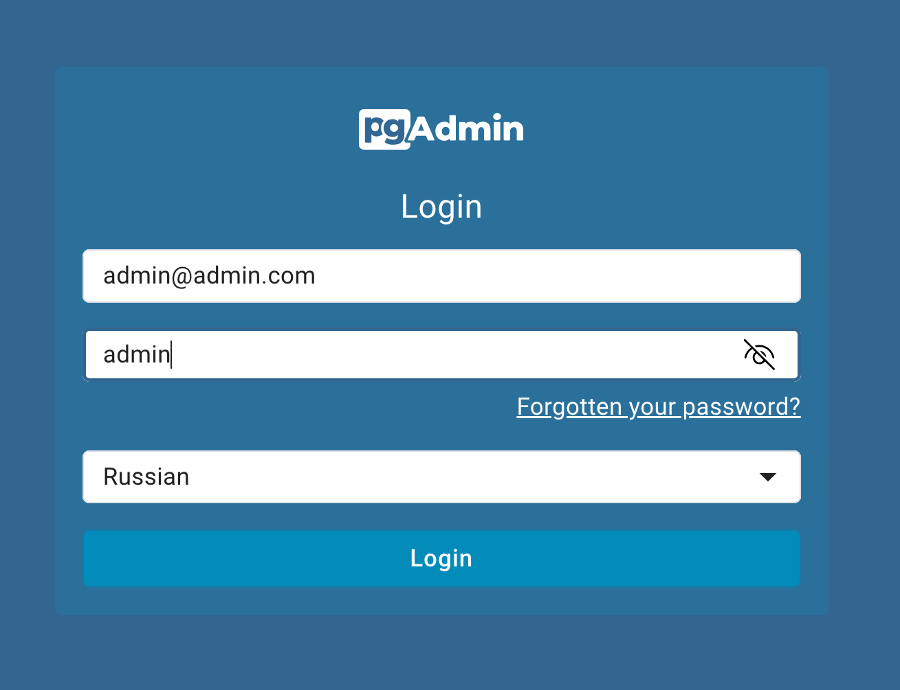
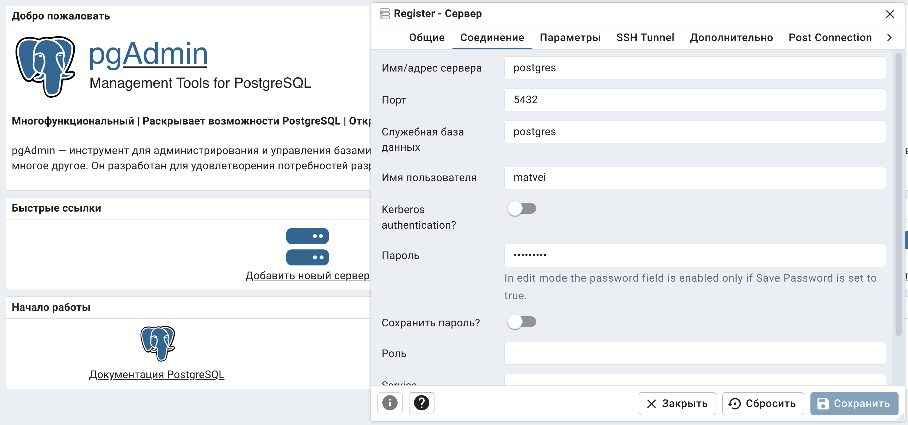
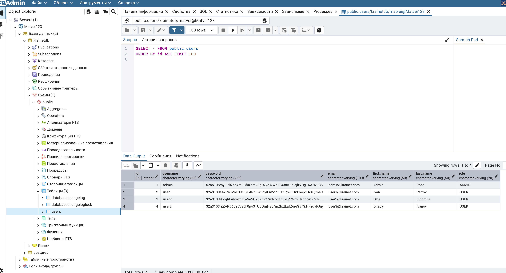

Перейти по адресу для доступа к базе данных `http://localhost:8081/login?next=/browser/`

1. Ввести данные логин и пароль:
- admin@admin.com
- admin

2. Нажать на «Добавить новый сервер»
3. Во вкладке «Общие» ввести любое имя 
4. Вкладку «Соединение» заполнить следующими данными:
- postgres
- 5432
- matvei
- secret123

5. Проверить, что в базе данных krainetdb есть таблица Users. А в ней четыре пользователя —
один ADMIN и три USER. 

